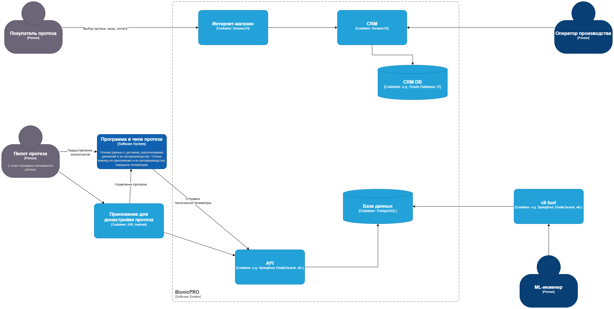

## Задание: 
Вам нужно улучшить безопасность приложения, заменив Code Grant на PKCE. Затем необходимо подготовить API для работы с отчётом.  

### Что нужно сделать:
Реализуйте PKCE. Его нужно добавить к существующим приложениям — фронтенду и Keycloak. Мы специально не рассказывали в теории, как это сделать. Чтобы разобраться, изучите официальную документацию.
Создайте бэкенд-часть приложения для API. Выберите удобный для вас язык — Pyhton, Java, C# или любой другой. Добавьте API /reports в этот бэкенд для передачи отчётов. Тут не требуется поход в базы данных, ограничьтесь генерацией произвольных данных. Реализация сбора фактических данных будет в следующем задании.
Перед отправкой задания проверьте, что:

### Перед отправкой задания проверьте, что:
1. Бэкенд отдаёт данные только пользователям с ролью prothetic_user. Эту роль мы добавили в последнем уроке первой темы.
2. Бэкенд проверяет валидность подписи токена. Если валидация не прошла, он выдаёт ошибку 401.

### C4 диаграмма контейнеров:

